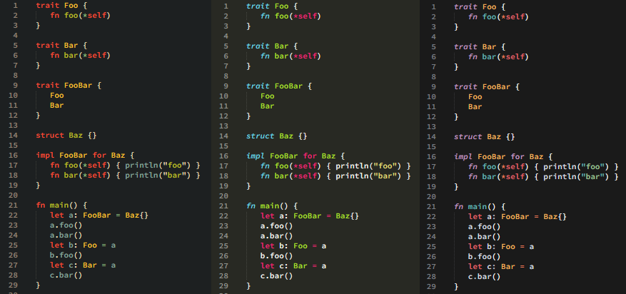

# Sublime Jule

A simple syntax highlighter for the [Jule programming language](https://github.com/julelang/jule)

## Setup
To use it clone the repository and add it to your Packages by going to `Preferances -> Browse Packages` and inside a folder named Jule add the `Jule.sublime-syntax` file.